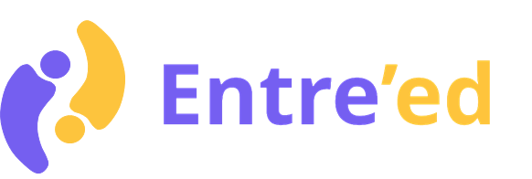

# ProjetPRAG

### Courte présentation - Qui sommes-nous ?

C’est autour d’un café que l’équipe Entre’Ed s’est créée. Jeu de mot entre entraide et éducation, c’est l’histoire d’une bande d'amis qui ont toujours eu du mal à trouver des informations et de l’aide sans payer une fortune pour du soutien dans l’enseignement supérieur. L’équipe Entre’Ed  s’est  dit  qu’il  fallait y  remédier.  Le  concept  est  simple,  inclure  des étudiants ainsi que d’anciens étudiants sur une plateforme de mise en relation dans une logique communautaire. Cela nous a amené à réfléchir à une solution novatrice n’existant pas sur le marché actuellement. Cette solution s’est donc naturellement centrée sur une thématique qui nous concerne, l’entraide dans le domaine des études de l’enseignement supérieur.

### Nos objectifs 

Nos objectifs sont les suivants :
●Mettre en place une association qui puisse se développer et se faireconnaître à l’échelle nationale dans le milieu universitaire ;
●Simplifier la démarche des étudiants souhaitant mettre en place des réseaux d’entraide sur les thématiques de groupes de soutien aux études et des perspectives d'évolutions professionnelles ;
●Permettre aux étudiants de bénéficier de l’expérience des anciens.

### Les fonctionnalités de notre plateforme

Notre plateforme dispose des fonctionnalités suivantes :
-  Connexion / Déconnexion / Inscription
-  Création / Suppression & Inscription / Desinscription d'une rencontre
-  Calendrier
-  Rejoindre une rencontre
-  Génération de lien Zoom
-  Mot de passe chiffré
-  Devenir Entre’Edeur/Entre’Edien

Elle disposera à l'avenir des fonctionnalités suivantes :
- Consulter le profil d’un Entre’Edeur
- Se connecter avec la double authentification
- S’abonner à un Entre’Edeur
- Système de paiement
- Evaluer un Entre’Edeur
- Mode administrateur
- Vérification par mail lors de l’inscription
